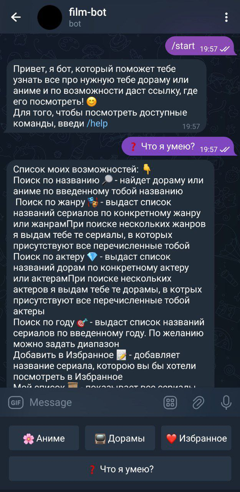
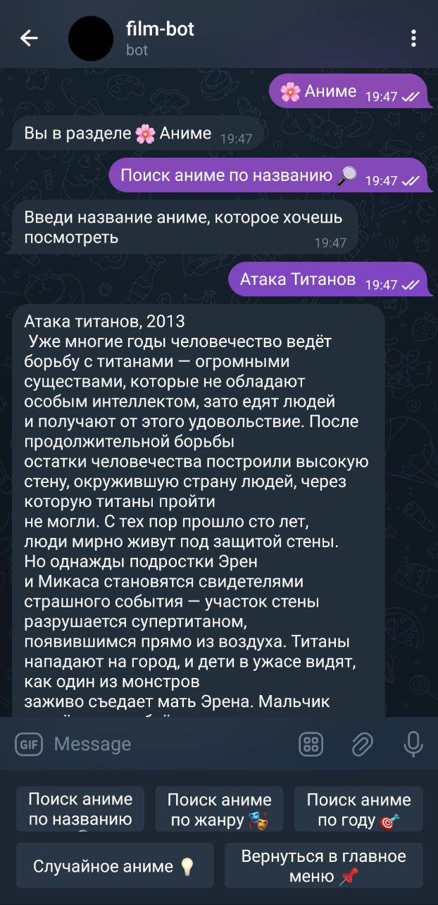
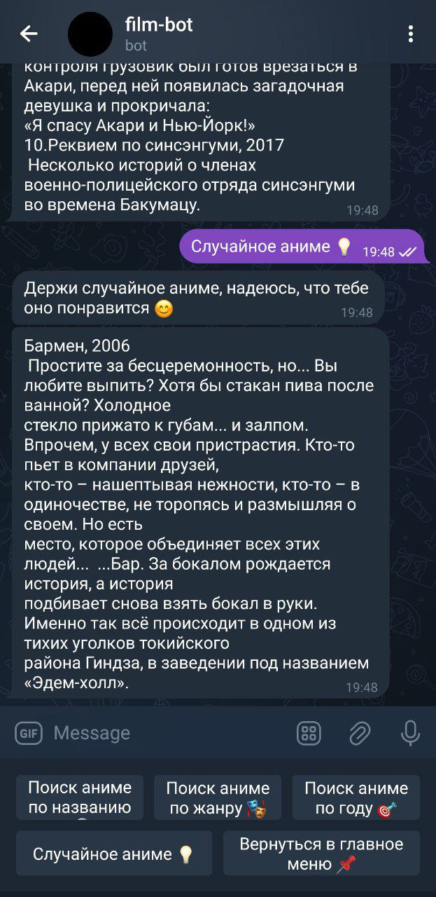
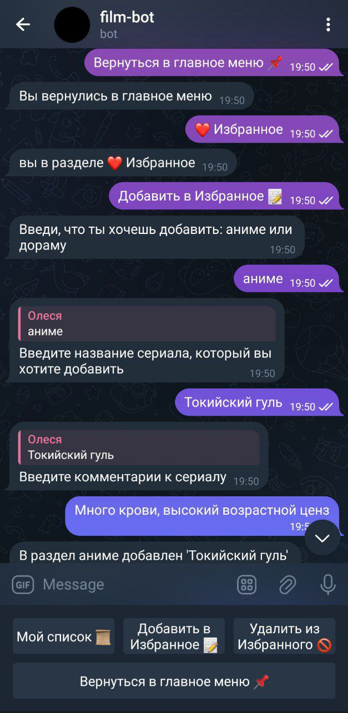

<h1 align="center">
Telegram бот DoranimeBot </h1>

<!-- Похвастаемся фуннкционалом бота -->

    
    
    
    

Telegram бот для поиска аниме/дорам по различным критериям.
С возможностью сохранять понравившиеся произведения в избранное.

**Критерии поиска**:

- Случайное произведение
- По названию
- Год выпуска или сразу диапазон
- Жанры произведения
- Актёры

> *Адрес бота в Telegram:* [@DoranimeBot](https://t.me/DoranimeBot)

## 

Просто введите текст, чтобы произвести поиск произведения.

- случайная дорама/аниме: Получаем случайное произведение из базы.
- `по жанру`: Вводим нужные жанры и получаем подходящие аниме/дорамы.
- `по названию` Ввдеите название аниме/дорамы и узнайте подробнее о ней.
- `по актеру` Введите имена актеров и получите дорамы с их участием.
- `по году` Вводим диапазон лет и получаем дорамы/аниме.
- работа с “Избранным” (‘Избранное’/’Добавить в избранное’/’Удалить из избранного’ - пользователь вводит название, бот обрабатывает и работает с персональным списком пользователя)
- `/help`: Ознакомиться с функциями бота.

## 

- Пустовалова Софья Алексеевна.
- Завьялова Полина Игоревна.
- Пеева Олеся Романовна.
- Крамаренко Юрий Андреевич.

> Для поиска дорам и аниме использовалось api с сайта https://kinopoisk.dev/

## 

> Будет обновлена несколько позже ...

Для того, чтобы собрать бота на своем устройстве:

1. Скопируйте все файлы в свой проект
2. Загрузите библиотеки mysql-connector, mysql-connector-python, telebot и pyTelegramBotAPI через pip install (или через Settings -> Python Interpreter, если у вас установлен PyCharm)

